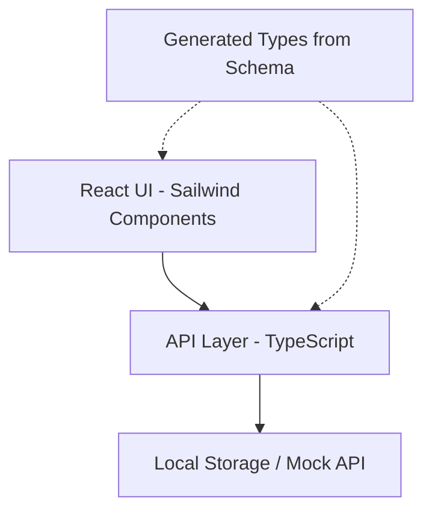

# Design Document: UX Metrics Capture and Review Application

## Clarifications

### Session 2026-01-27
- Q: How should the system handle empty states in the UI? → A: Display contextual empty state messages with guidance (e.g., "No sessions yet. Create your first session to start capturing metrics.")
- Q: Which export format should be prioritized for MVP? → A: JSON only (simplest, machine-readable)
- Q: What visualization approach for metrics in reports? → A: Chart visualizations using Recharts library
- Q: How should user access be handled? → A: No authentication (open access, single implicit user)
- Q: How should participants, facilitators, and observers be managed? → A: Maintain a people list (create/select from dropdown)
- Q: What backup mechanism for local storage prototype? → A: Manual export/import (download JSON file, upload to restore)

## Overview

The UX Metrics Capture and Review Application is a web-based system for capturing, analyzing, and sharing usability metrics. The application supports both moderated usability sessions and programmatic data collection, focusing on five core assessment types: Task Success Rate, Time on Task, Task Efficiency, Error Rate, and Single Ease Question (SEQ).

The system follows a schema-first approach where the API contract and concept model evolve alongside the prototype. The architecture emphasizes simplicity, with a React frontend using Sailwind components, a TypeScript-based data layer, and local storage for persistence during prototyping.

## Architecture

### System Architecture



### Technology Stack

- **Frontend**: React with TypeScript
- **Component Library**: Sailwind (@pglevy/sailwind)
- **Charts**: Recharts (for metric visualizations)
- **API Contract**: OpenAPI 3.1 (schema/api-contract.yaml)
- **Type Generation**: OpenAPI TypeScript Generator
- **Data Storage**: Local Storage (prototype phase)
- **Build Tool**: Vite

### Key Architectural Decisions

1. **Schema-First Development**: API contract defined in OpenAPI before implementation, with types generated from schema
2. **Local Storage for Prototyping**: Simplifies initial development; can be replaced with backend API later
3. **Component-Based UI**: Sailwind provides consistent, accessible components
4. **Separation of Concerns**: Clear boundaries between UI, business logic, and data access
5. **No Authentication**: Open access prototype with single implicit user; authentication deferred to production phase

## Components and Interfaces

### Core Domain Entities

#### Study
```typescript
interface Study {
  id: string;
  name: string;
  productId: string;
  featureId?: string;
  createdAt: string;
  updatedAt: string;
  archived: boolean;
}
```

#### Session
```typescript
interface Session {
  id: string;
  studyId: string;
  participantId: string;
  facilitatorId: string;
  observerIds: string[];
  createdAt: string;
  completedAt?: string;
  status: 'in_progress' | 'completed';
}
```

#### Assessment Type
```typescript
interface AssessmentType {
  id: string;
  name: string;
  type: 'task_success_rate' | 'time_on_task' | 'task_efficiency' | 'error_rate' | 'seq';
  questions: Question[];
}

interface Question {
  id: string;
  text: string;
  responseType: 'boolean' | 'number' | 'text' | 'rating';
  validationRules?: ValidationRule[];
}
```

#### Assessment Response
```typescript
interface AssessmentResponse {
  id: string;
  sessionId: string;
  assessmentTypeId: string;
  taskDescription: string;
  responses: Record<string, any>;
  calculatedMetrics: Record<string, number>;
  createdAt: string;
}
```

#### Person
```typescript
interface Person {
  id: string;
  name: string;
  role: 'participant' | 'facilitator' | 'observer';
  createdAt: string;
}
```

### UI Components

#### Empty State Handling
All list views and data displays should show contextual empty state messages with guidance when no data exists:
- **StudyList empty**: "No studies yet. Create your first study to start organizing usability evaluations."
- **SessionList empty**: "No sessions in this study. Create a session to begin capturing participant data."
- **AssessmentList empty**: "No assessments recorded. Select an assessment type to start capturing metrics."
- **MetricsDashboard empty**: "No metrics data available. Complete sessions with assessments to see aggregated results."

#### Study Management
- **StudyList**: Display all studies with filtering and search
- **StudyForm**: Create/edit study details
- **StudyDetail**: View study overview with sessions and metrics

#### Session Management
- **SessionList**: Display sessions within a study
- **SessionForm**: Create new session with participant/facilitator selection
- **SessionDetail**: View session details and administer assessments

#### Assessment Administration
- **AssessmentSelector**: Choose which assessments to administer
- **TaskSuccessRateForm**: Capture task success/failure
- **TimeOnTaskForm**: Capture start/end times or manual duration
- **TaskEfficiencyForm**: Capture optimal vs actual steps
- **ErrorRateForm**: Capture errors and opportunities
- **SEQForm**: Capture 1-7 ease rating

#### Analysis and Reporting
- **MetricsDashboard**: Aggregated metrics across sessions
- **ReportGenerator**: Create shareable reports with visualizations
- **MetricsComparison**: Compare metrics across studies or time periods

### API Layer

#### Study Service
```typescript
interface StudyService {
  createStudy(data: CreateStudyRequest): Promise<Study>;
  getStudies(filters?: StudyFilters): Promise<Study[]>;
  getStudyById(id: string): Promise<Study>;
  updateStudy(id: string, data: UpdateStudyRequest): Promise<Study>;
  archiveStudy(id: string): Promise<void>;
}
```

#### Session Service
```typescript
interface SessionService {
  createSession(data: CreateSessionRequest): Promise<Session>;
  getSessionsByStudy(studyId: string, filters?: SessionFilters): Promise<Session[]>;
  getSessionById(id: string): Promise<Session>;
  completeSession(id: string): Promise<Session>;
}
```

#### Assessment Service
```typescript
interface AssessmentService {
  getAssessmentTypes(): Promise<AssessmentType[]>;
  createAssessmentResponse(data: CreateAssessmentRequest): Promise<AssessmentResponse>;
  getAssessmentsBySession(sessionId: string): Promise<AssessmentResponse[]>;
}
```

#### Analytics Service
```typescript
interface AnalyticsService {
  getStudyMetrics(studyId: string, filters?: MetricFilters): Promise<AggregatedMetrics>;
  compareMetrics(comparison: MetricComparison): Promise<ComparisonResult>;
  generateReport(studyId: string, options: ReportOptions): Promise<Report>;
}
```

#### Person Service
```typescript
interface PersonService {
  createPerson(data: CreatePersonRequest): Promise<Person>;
  getPeople(filters?: PersonFilters): Promise<Person[]>;
  getPersonById(id: string): Promise<Person>;
  updatePerson(id: string, data: UpdatePersonRequest): Promise<Person>;
  deletePerson(id: string): Promise<void>;
}
```

## Data Models

### Calculation Models

#### Task Success Rate
```typescript
interface TaskSuccessRateData {
  taskDescription: string;
  successful: boolean;
}

function calculateSuccessRate(responses: TaskSuccessRateData[]): number {
  const successful = responses.filter(r => r.successful).length;
  return (successful / responses.length) * 100;
}
```

#### Time on Task
```typescript
interface TimeOnTaskData {
  taskDescription: string;
  startTime?: string;
  endTime?: string;
  manualDurationSeconds?: number;
}

function calculateDuration(data: TimeOnTaskData): number {
  if (data.manualDurationSeconds) {
    return data.manualDurationSeconds;
  }
  const start = new Date(data.startTime!);
  const end = new Date(data.endTime!);
  return (end.getTime() - start.getTime()) / 1000;
}
```

#### Task Efficiency
```typescript
interface TaskEfficiencyData {
  taskDescription: string;
  optimalSteps: number;
  actualSteps: number;
}

function calculateEfficiency(data: TaskEfficiencyData): number {
  return (data.optimalSteps / data.actualSteps) * 100;
}
```

#### Error Rate
```typescript
interface ErrorRateData {
  taskDescription: string;
  errors: ErrorDetail[];
  opportunities: number;
}

interface ErrorDetail {
  type: 'wrong_click' | 'invalid_submission' | 'navigation_error';
  description: string;
}

function calculateErrorRate(data: ErrorRateData): number {
  return (data.errors.length / data.opportunities) * 100;
}
```

#### Single Ease Question
```typescript
interface SEQData {
  taskDescription: string;
  rating: number; // 1-7
}

function validateSEQRating(rating: number): boolean {
  return rating >= 1 && rating <= 7 && Number.isInteger(rating);
}
```

### Aggregation Models

```typescript
interface AggregatedMetrics {
  studyId: string;
  sessionCount: number;
  participantCount: number;
  dateRange: { start: string; end: string };
  metrics: {
    taskSuccessRate: { mean: number; count: number };
    timeOnTask: { median: number; mean: number; count: number };
    taskEfficiency: { mean: number; count: number };
    errorRate: { mean: number; count: number };
    seq: { mean: number; count: number };
  };
}
```

### Seed Data Model

```typescript
interface SeedData {
  studies: Study[];
  sessions: Session[];
  assessmentTypes: AssessmentType[];
  assessmentResponses: AssessmentResponse[];
  participants: Participant[];
  facilitators: Facilitator[];
}
```

## Correctness Properties

*A property is a characteristic or behavior that should hold true across all valid executions of a system—essentially, a formal statement about what the system should do. Properties serve as the bridge between human-readable specifications and machine-verifiable correctness guarantees.*


### Property 1: Study CRUD Round Trip
*For any* study with valid name, product ID, and optional feature ID, creating the study then retrieving it should return a study with all the original data preserved and a unique ID assigned.
**Validates: Requirements 1.1, 1.2, 1.3**

### Property 2: Study Update Preservation
*For any* existing study and any valid update data, updating the study then retrieving it should return the study with all updates applied.
**Validates: Requirements 1.4**

### Property 3: Study Archive Flag
*For any* existing study, archiving it then retrieving it should return the study with archived flag set to true.
**Validates: Requirements 1.5**

### Property 4: Session Creation Requires Fields
*For any* session creation attempt missing required fields (studyId, participantId, or facilitatorId), the system should reject the creation.
**Validates: Requirements 2.1**

### Property 5: Session Optional Observers
*For any* valid session data, creating a session with or without observer IDs should succeed and preserve the observer list.
**Validates: Requirements 2.2**

### Property 6: Unique ID Generation
*For any* collection of created entities (studies or sessions), all assigned IDs should be unique.
**Validates: Requirements 1.2, 2.3**

### Property 7: Session Timestamp Generation
*For any* created session, the createdAt timestamp should be a valid ISO 8601 date string representing a time at or before the current time.
**Validates: Requirements 2.3**

### Property 8: Session Filtering by Study
*For any* study with sessions and any other study, retrieving sessions for the first study should return only sessions belonging to that study.
**Validates: Requirements 2.4**

### Property 9: Session Filtering by Attributes
*For any* collection of sessions with varied participants, facilitators, and dates, filtering by any attribute should return only sessions matching that filter.
**Validates: Requirements 2.5**

### Property 10: Assessment Type Required Fields
*For any* assessment type creation attempt missing required fields (name, type, or questions), the system should reject the creation.
**Validates: Requirements 3.2**

### Property 11: Assessment Type Reusability
*For any* assessment type, using it in multiple sessions should work correctly and all sessions should reference the same assessment type ID.
**Validates: Requirements 3.3**

### Property 12: Assessment Data Persistence
*For any* assessment response with task description and response data, creating it then retrieving it should return all data preserved exactly.
**Validates: Requirements 4.4, 5.4, 6.4, 7.4, 8.3**

### Property 13: Assessment Type Update Preservation
*For any* existing assessment type and any valid updates, updating it then retrieving it should return the assessment type with all updates applied.
**Validates: Requirements 3.5**

### Property 14: Task Success Rate Calculation
*For any* collection of task attempts with boolean success values, the calculated success rate should equal (successful count / total count) × 100.
**Validates: Requirements 4.2**

### Property 15: Multiple Assessments Per Session
*For any* session and any collection of valid assessment responses, all assessments should be stored and associated with the session ID.
**Validates: Requirements 4.3, 9.1, 9.2**

### Property 16: Time on Task Duration Calculation
*For any* time-on-task assessment with start and end times, the calculated duration should equal the difference in seconds between end and start.
**Validates: Requirements 5.2**

### Property 17: Manual Time Entry Support
*For any* time-on-task assessment with manual duration in seconds, the duration should be stored and retrieved exactly as entered.
**Validates: Requirements 5.3**

### Property 18: Duration Formatting
*For any* duration in seconds, formatting it as human-readable should produce a string containing minutes and seconds in the format "Xm Ys".
**Validates: Requirements 5.5**

### Property 19: Task Efficiency Calculation
*For any* task efficiency assessment with optimal and actual steps, the calculated efficiency should equal (optimal steps / actual steps) × 100.
**Validates: Requirements 6.2**

### Property 20: Time-Based Efficiency Calculation
*For any* task efficiency assessment with optimal and actual time values, the calculated efficiency should equal (optimal time / actual time) × 100.
**Validates: Requirements 6.3**

### Property 21: Error Rate Calculation
*For any* error rate assessment with error count and opportunities, the calculated error rate should equal (errors / opportunities) × 100.
**Validates: Requirements 7.2**

### Property 22: Error Type Categorization
*For any* error with a type (wrong_click, invalid_submission, or navigation_error), the error should be stored with its type and retrievable by type.
**Validates: Requirements 7.3**

### Property 23: SEQ Rating Validation
*For any* SEQ rating value, values between 1 and 7 (inclusive) should be accepted, and values outside this range should be rejected.
**Validates: Requirements 8.2**

### Property 24: SEQ Uniqueness Per Task Per Session
*For any* session and task, attempting to create a second SEQ rating for the same task should be rejected.
**Validates: Requirements 8.5**

### Property 25: Assessment Order Independence
*For any* collection of assessments for a session, creating them in any order should result in all assessments being stored correctly.
**Validates: Requirements 9.3**

### Property 26: Incremental Assessment Persistence
*For any* assessment, after creating it, it should be retrievable before any other assessments are created.
**Validates: Requirements 9.4**

### Property 27: Session Completion Status
*For any* session, marking it as complete should update its status to 'completed' and set the completedAt timestamp.
**Validates: Requirements 9.5**

### Property 28: Time on Task Median Calculation
*For any* collection of time-on-task durations, the calculated median should be the middle value when sorted (or average of two middle values for even counts).
**Validates: Requirements 10.1**

### Property 29: Metric Mean Calculations
*For any* collection of assessment values (success rates, efficiency, error rates, or SEQ ratings), the calculated mean should equal the sum divided by the count.
**Validates: Requirements 10.2**

### Property 30: Aggregated Data Filtering
*For any* collection of assessments with varied dates, participants, and tasks, filtering aggregated data should include only assessments matching the filter criteria.
**Validates: Requirements 10.3**

### Property 31: Comparison Metrics Calculation
*For any* two studies or time periods with assessment data, comparison metrics should show the difference or ratio between their aggregated values.
**Validates: Requirements 10.4**

### Property 32: Incremental Aggregation Updates
*For any* study with calculated aggregations, adding new assessment data then recalculating should include the new data in the results.
**Validates: Requirements 10.5**

### Property 33: Report Generation Completeness
*For any* study with sessions and assessments, a generated report should include aggregated metrics, participant count, and session count.
**Validates: Requirements 11.1, 11.2**

### Property 34: Report Export Format Validity
*For any* generated report, exporting it should produce valid JSON output.
**Validates: Requirements 11.3**

### Property 35: Report Commentary Inclusion
*For any* report with added commentary or notes, the exported report should include all commentary text.
**Validates: Requirements 11.5**

### Property 36: Entity Persistence Round Trip
*For any* entity (study, session, assessment type, or assessment response), creating it then retrieving it should return the entity with all data preserved.
**Validates: Requirements 12.1**

### Property 37: Persistence Failure Error Handling
*For any* persistence operation that fails, the system should return an error and the data should remain accessible in memory.
**Validates: Requirements 12.3**

### Property 38: Data Backup and Recovery
*For any* collection of entities, exporting data as JSON, clearing local storage, then importing the JSON file should result in all original data being recovered.
**Validates: Requirements 12.4**

## Error Handling

### Validation Errors
- **Invalid Input**: Return clear error messages indicating which fields are invalid
- **Missing Required Fields**: Return 400 Bad Request with list of missing fields
- **Invalid Data Types**: Return 400 Bad Request with type mismatch details
- **Out of Range Values**: Return 400 Bad Request with valid range information

### Business Logic Errors
- **Duplicate SEQ Rating**: Return 409 Conflict when attempting to create duplicate SEQ for same task/session
- **Invalid Study Reference**: Return 404 Not Found when session references non-existent study
- **Invalid Session Reference**: Return 404 Not Found when assessment references non-existent session
- **Archived Study Modification**: Return 403 Forbidden when attempting to modify archived study

### Persistence Errors
- **Storage Failure**: Return 500 Internal Server Error, retain data in memory, log error details
- **Backup Failure**: Return 500 Internal Server Error, log error details, notify user
- **Recovery Failure**: Return 500 Internal Server Error, log error details, provide manual recovery instructions

### Calculation Errors
- **Division by Zero**: Return 0 or null for rates when denominator is zero, log warning
- **Empty Data Set**: Return null or empty result for aggregations on empty data, don't error
- **Invalid Timestamps**: Return 400 Bad Request when start time is after end time

## Testing Strategy

### Dual Testing Approach

The testing strategy employs both unit tests and property-based tests to ensure comprehensive coverage:

**Unit Tests** focus on:
- Specific examples demonstrating correct behavior
- Edge cases (empty data sets, boundary values, zero denominators)
- Error conditions and validation failures
- Integration between components
- Seed data loading and reset functionality

**Property-Based Tests** focus on:
- Universal properties that hold for all valid inputs
- Calculation correctness across random inputs
- Data persistence and retrieval consistency
- CRUD operation correctness
- Filtering and aggregation accuracy

### Property-Based Testing Configuration

**Library**: fast-check (for TypeScript/JavaScript)

**Configuration**:
- Minimum 100 iterations per property test
- Each test tagged with feature name and property number
- Tag format: `// Feature: ux-metrics-app, Property N: [property text]`

**Example Property Test**:
```typescript
import fc from 'fast-check';

// Feature: ux-metrics-app, Property 14: Task Success Rate Calculation
test('task success rate calculation', () => {
  fc.assert(
    fc.property(
      fc.array(fc.boolean(), { minLength: 1 }),
      (attempts) => {
        const successCount = attempts.filter(s => s).length;
        const expected = (successCount / attempts.length) * 100;
        const actual = calculateSuccessRate(attempts);
        expect(actual).toBeCloseTo(expected, 2);
      }
    ),
    { numRuns: 100 }
  );
});
```

### Test Organization

```
tests/
├── unit/
│   ├── study.test.ts
│   ├── session.test.ts
│   ├── assessments.test.ts
│   ├── analytics.test.ts
│   └── seed-data.test.ts
├── properties/
│   ├── crud-properties.test.ts
│   ├── calculation-properties.test.ts
│   ├── persistence-properties.test.ts
│   └── aggregation-properties.test.ts
└── integration/
    ├── session-workflow.test.ts
    └── report-generation.test.ts
```

### Seed Data Testing

Unit tests should verify:
- Seed data contains at least 2 studies with different products
- Seed data contains at least 5 sessions
- Seed data contains all 5 assessment types
- Seed data has varied metric values (not all identical)
- Seed data can be loaded on initialization
- Seed data can be reset/cleared

### Coverage Goals

- Unit test coverage: 80% of code paths
- Property test coverage: 100% of correctness properties
- Integration test coverage: All major user workflows
- Edge case coverage: All identified boundary conditions
