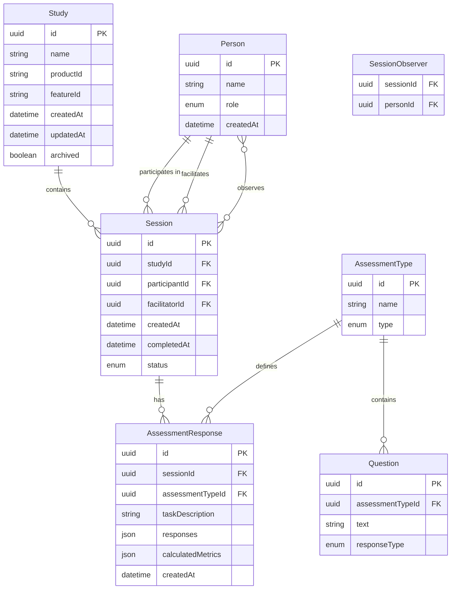
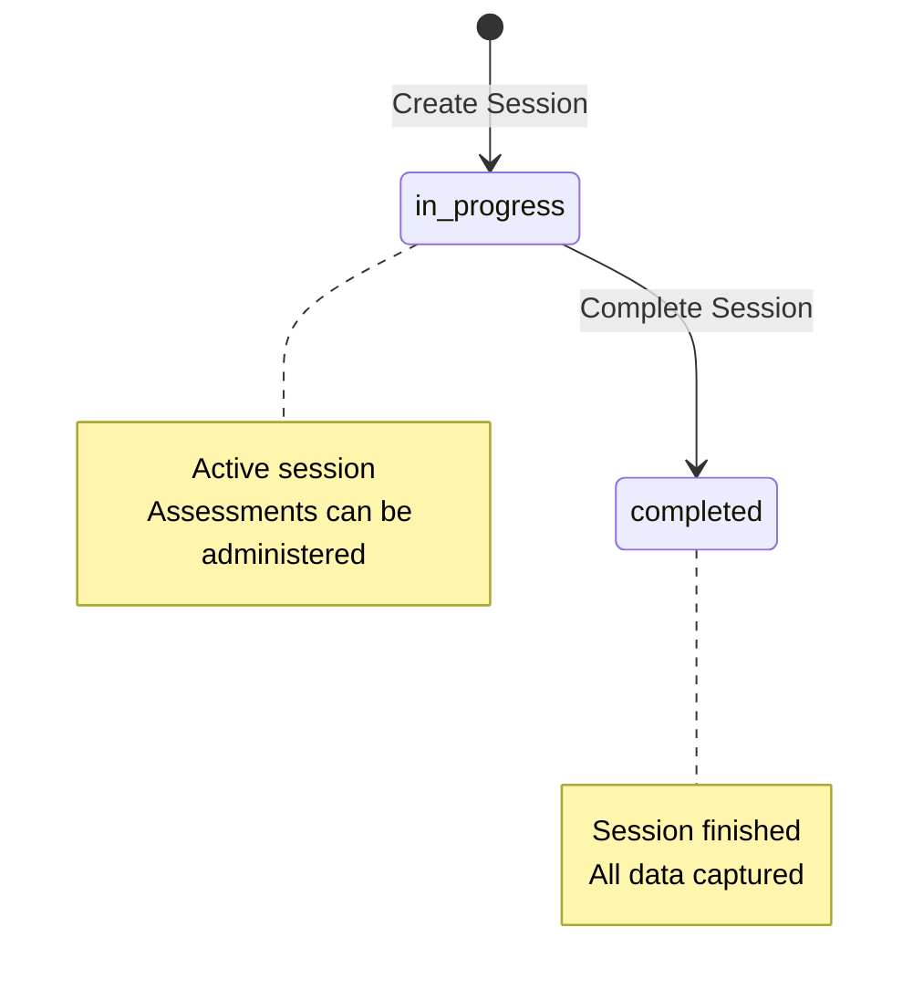
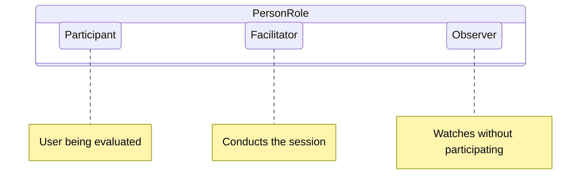
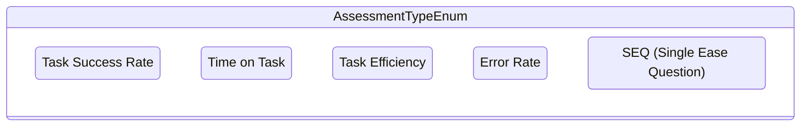
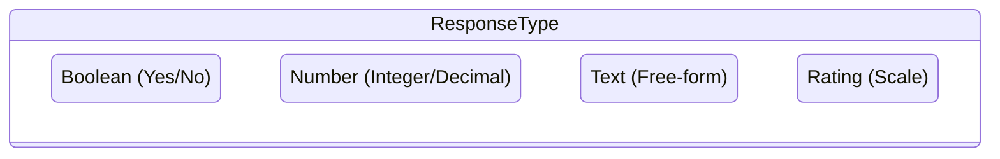
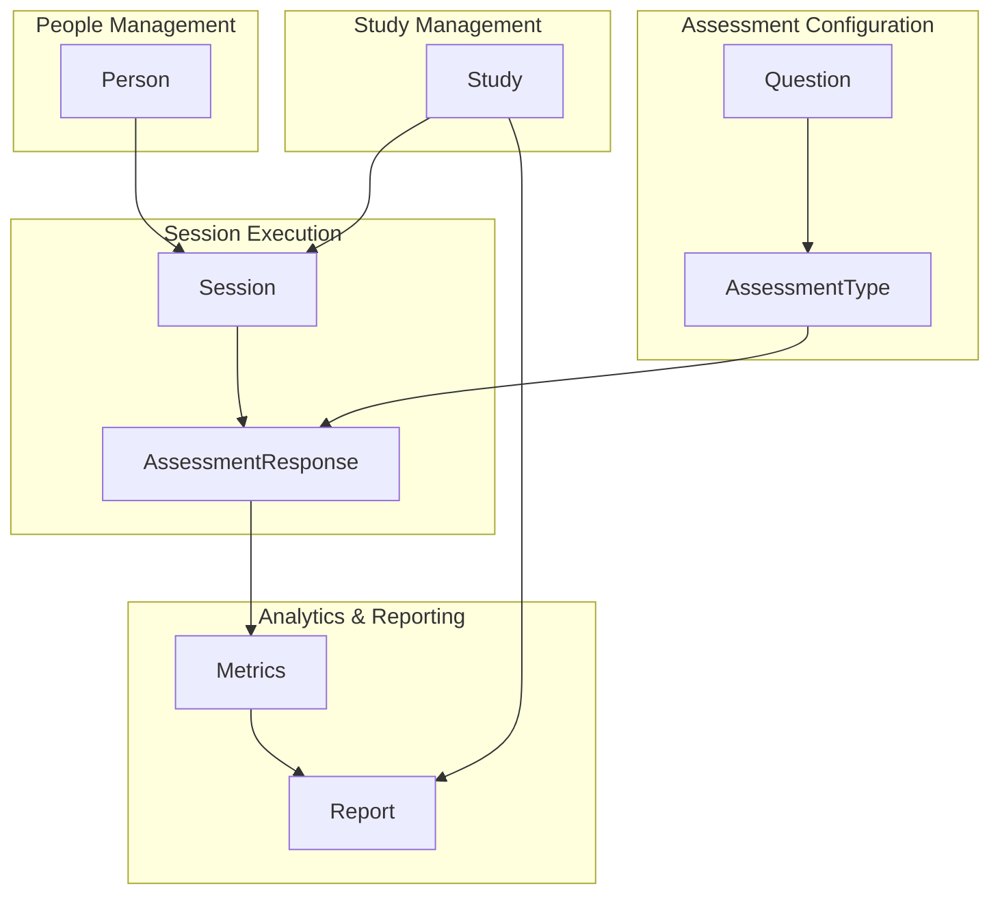
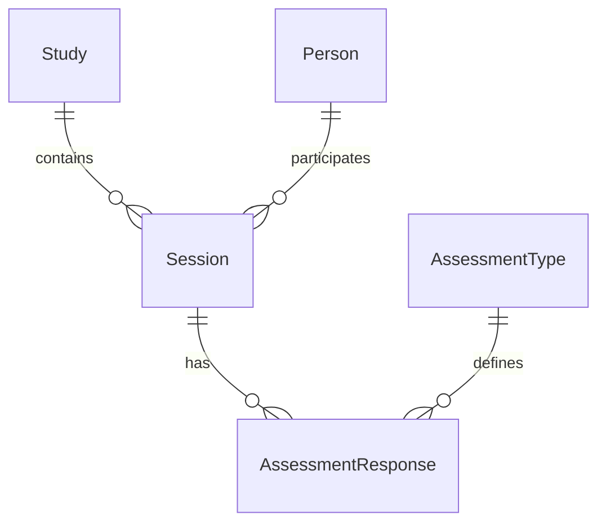

# Entity Relationship Diagram

This diagram visualizes the entities (nouns) and their relationships (verbs) in the UX Metrics Capture and Review Application.

---

## Current State

**Legend:**
- **PK**: Primary Key
- **FK**: Foreign Key
- **Solid entities**: Currently implemented in schema

---

## Relationship Details

### Study → Session
- **Cardinality**: One-to-many
- **Description**: A study contains zero or more sessions
- **Constraint**: Sessions cannot exist without a parent study

### Person → Session (Participant)
- **Cardinality**: One-to-many
- **Description**: A person (as participant) can be in many sessions; each session has exactly one participant
- **Constraint**: participantId is required

### Person → Session (Facilitator)
- **Cardinality**: One-to-many
- **Description**: A person (as facilitator) can conduct many sessions; each session has exactly one facilitator
- **Constraint**: facilitatorId is required

### Person → Session (Observer)
- **Cardinality**: Many-to-many
- **Description**: A person can observe many sessions; a session can have many observers
- **Constraint**: observerIds is optional (can be empty array)
- **Implementation**: Array of person IDs stored in session

### Session → AssessmentResponse
- **Cardinality**: One-to-many
- **Description**: A session contains zero or more assessment responses
- **Constraint**: Each response belongs to exactly one session

### AssessmentType → AssessmentResponse
- **Cardinality**: One-to-many
- **Description**: An assessment type can be used in many responses
- **Constraint**: Assessment types are reusable across sessions

### AssessmentType → Question
- **Cardinality**: One-to-many
- **Description**: An assessment type contains one or more questions
- **Constraint**: At least one question is required

---

## Cardinality Notation

| Symbol | Meaning |
|--------|---------|
| `\|\|` | Exactly one |
| `\|o` | Zero or one |
| `}{` | One or more |
| `}o` | Zero or more |

---

## Enumeration Values

### Session Status

### Person Role

### Assessment Type

### Response Type

---

## Data Flow Diagram

---

## Simplified View (Core Entities Only)

This simplified view shows the four main entity relationships:
1. Studies organize sessions
2. Sessions capture assessment responses
3. Assessment types define how responses are structured
4. People participate in sessions

---

## Evolution Notes

**2026-01-27**: Initial ERD created for UX Metrics Application
- Six core entities defined
- Relationships mapped including many-to-many for observers
- Enumeration values documented
- Data flow diagram added for context

**Future Enhancements:**
- Add Team/Organization entity for multi-tenant support
- Add User entity for authentication
- Add AuditLog entity for change tracking
- Add Tag entity for study categorization
- Add Comparison entity for cross-study analysis
