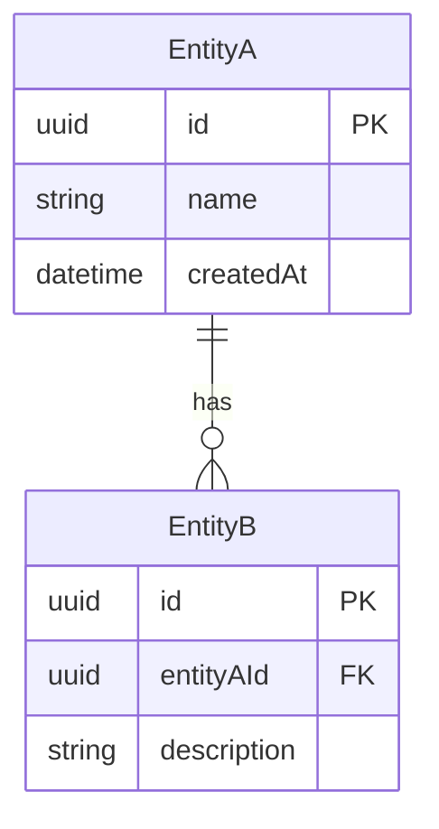
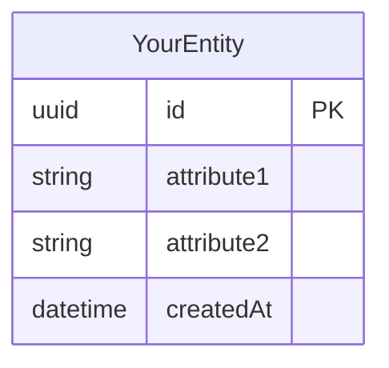
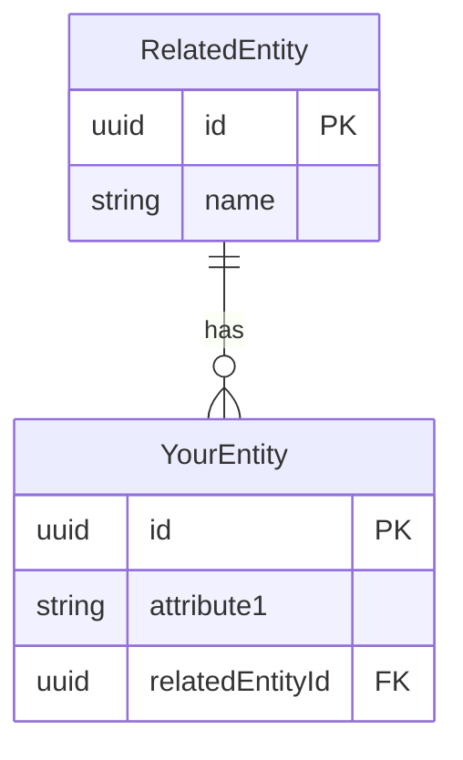
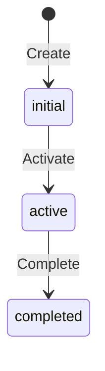

# Entity Relationship Diagram

This document visualizes the entities and their relationships in your system using Mermaid diagrams.

**Replace this placeholder content with your domain's entities.**

---

## Instructions

As your schema evolves, maintain this diagram to show:
- **Entities**: The main nouns in your system (e.g., User, Order, Product)
- **Attributes**: Key properties of each entity
- **Relationships**: How entities connect (one-to-many, many-to-many, etc.)

### Creating an ERD

Use Mermaid `erDiagram` syntax:

### Cardinality Notation

| Symbol | Meaning |
|--------|---------|
| `||` | Exactly one |
| `|o` | Zero or one |
| `}{` | One or more |
| `}o` | Zero or more |

**Example relationships:**
- `EntityA ||--o{ EntityB` = One EntityA has zero or more EntityB
- `EntityA ||--|| EntityB` = One EntityA has exactly one EntityB
- `EntityA }o--o{ EntityB` = Many-to-many (via join table)

---

## Example

See [examples/ticketing-system/concept-model/entity-relationship-diagram.md](../examples/ticketing-system/concept-model/entity-relationship-diagram.md) for a complete example.

---

## Template

### Current State

### Future State (Planned)

Use this section to sketch planned entities and relationships before implementation.

---

## State Diagrams (Optional)

If your entities have lifecycle states, use a state diagram:

---

## Evolution Notes

Track major changes to your entity model:

**[Date]**: [Description of change]
- [Detail 1]
- [Detail 2]
