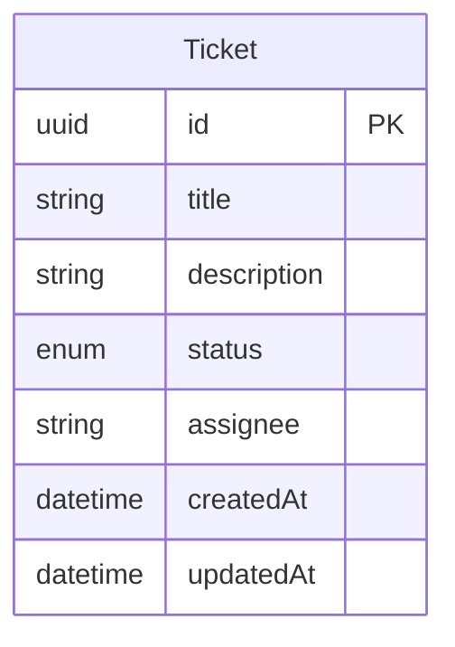
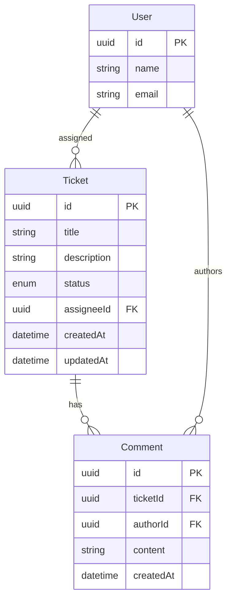
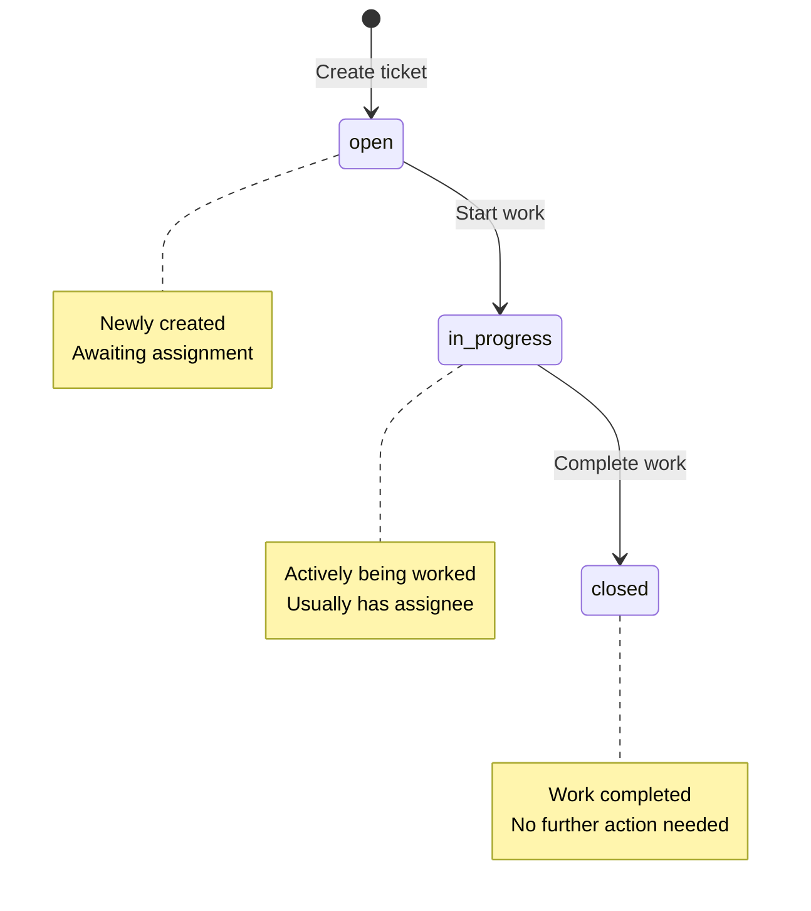

# Entity Relationship Diagram

This diagram visualizes the entities (nouns) and their relationships (verbs) in the ticketing system.

---

## Current State

**Legend:**
- **Solid entities**: Currently implemented
- **Attributes shown**: Core fields as defined in domain model

---

## Future State (Planned)

**Relationships:**
- **User → Ticket** (assigned): A user can be assigned zero or more tickets; a ticket optionally has one assignee
- **Ticket → Comment** (has): A ticket can have many comments; each comment belongs to one ticket
- **User → Comment** (authors): A user can author many comments; each comment has one author

**Note on Dependencies:**
- Ticket-to-ticket dependencies (blocking relationships) are planned but not shown in this ERD
- These would typically be implemented via a join table (TicketDependency) for many-to-many relationships

---

## Cardinality Notation

| Symbol | Meaning |
|--------|---------|
| `||` | Exactly one |
| `|o` | Zero or one |
| `}{` | One or more |
| `}o` | Zero or more |

---

## Status Enumeration

---

## Evolution Notes

**2026-01-14**: Initial ERD created
- Single entity (Ticket) in current state
- Future relationships sketched for planning
- Using Mermaid for easy updates and version control

**Future Enhancements:**
- Add User entity and proper assignee relationship
- Add Comment entity for conversation threads
- Add ticket dependencies (blocking relationships)
- Consider Priority/Severity enumerations
- Consider Category/Tag entities
